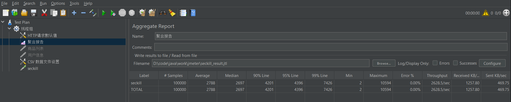
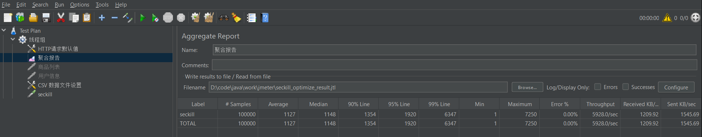

#### 项目介绍

开发一个基于springboot的高并发限时抢购秒杀系统，实现了基本的登录、查看商品列表、秒杀、下单等功能，并针对高并发问题进行了优化，实现了系统缓存、降级和限流。

前端使用模版thymeleaf实现，后端使用springboot、mybatis、mysql实现，用到的中间件有 druid、redis、rabbitmq、:red_circle: **guava**。

秒杀的高并发问题：大量的请求都阻塞在后端数据层，数据读写锁严重冲突，几乎所有的请求都超时，虽然流量很大，但下单成功的流量很少。

解决方法：

 	1. 通过:red_circle:**降级和限流**减少对数据库的访问。
 	2. 秒杀商品是个典型的读多写少的场景，可以充分利用 :red_circle: **缓存**来提高并发量。

技术点：

1. 两次MD5加密（MD5是消息摘要算法的一种，是一种单向加密算法，具有压缩性、抗修改性、容易计算、强抗碰撞性）。

   - 用户输入的密码和固定的salt通过md5加密生成新的密码：避免用户明文密码在网络传输。
   - 第一次加密的密码和随机生成的salt进行第二次MD5加密生成最终密码，将最终密码和随机生成的salt存在数据库中：防止数据库被攻击，通过MD5反解出密码。

2. 分布式session

   - 用户登录时，验证用户账号和密码都正确后，使用uuid生成用户的token，将（token, 用户信息）存入到redis中，并将token 存到缓存中。
   - 好处：在分布式集群中，不同的服务器之间需要及时的同步session信息，延时会导致session不一致，使用redis把session数据存储起来就能解决掉不一致的问题。

3. JSR303自定义参数验证

   - 使用JSR303自定义校验器(JSP303是Java为Bean数据合法性校验提供的标准框架，自定义message提示校验规则，实现标准的校验类进行校验)，实现对用户账号和密码的验证，使验证逻辑从业务代码中脱离出来。
   - 实现@interface，使用@Contraint设置验证类（实现ConstraintValidator），并实现验证类（initialize、isValid）。
   - 用户账号验证逻辑：使用 :red_circle: **正则表达式**

4. 全局异常处理

   - 自定义异常处理器，拦截所有异常，对各种异常进行相应的处理。
   - 自定义运行异常返回的状态码和异常信息，并定义了一个进行时异常的子类来包装，最后由自定义异常处理器统一处理。有利于追踪异常位置，也有利于异常管理。

5. 页面缓存和对象缓存

   - 将手动渲染（通过js的func）的html页面缓存在redis中，减少页面资源的加载，提供更好的用户体验。
   - 将用户、商品、订单等信息缓存在redis中，以减少对数据库的访问。

6. 本地标记+redis预处理+rabbitMq异步下单+客户端轮询

   - 本地标记：在秒杀阶段，本地标记库存不足的秒杀商品，若被标记，所有对该商品发起秒杀的请求直接返回秒杀结束。
   - redis预处理：在秒杀开始前，将商品和库存信息同步到redis中，通过redis预减库存，判断是否能进行秒杀操作，减少对数据库的访问。
   - rabbitmq异步下单：防止高流量请求导致系统崩溃，使用rabbitmq用异步队列来处理下单。
   - 客户端轮询：因为异步队列处理下单的方式，所以客户端实现了一个接口采用轮询的方式来请求下单结果。

7. 解决超卖

   - 如果下单成功，需要修改商品库存，在修改之前，先判断库存>0，再减库存，防止超卖。
   - 对用户id和商品id建立一个索引，防止一个用户发起多次秒杀请求，秒杀到同一件商品。

8. 使用数学公式验证码

   - 点击秒杀前，先让用户输入数学公式验证码，验证正确才能进行秒杀。
   - 防止恶意的机器人和爬虫 
   - 分散用户的请求

9. 使用RateLimiter实现限流

   - 当我们去秒杀一些商品时，此时可能会因为访问量太大而导致系统崩溃，此时要使用限流来进行限制访问量，当达到限流阀值，后续请求会被降级；降级后的处理方案可以是：返回排队页面（高峰期访问太频繁，等一会重试）、错误页等。
   - 实现：项目使用RateLimiter来实现限流，RateLimiter是guava提供的基于令牌桶算法的限流实现类，通过调整生成token的速率来限制用户频繁访问秒杀页面，从而达到防止超大流量冲垮系统。（令牌桶算法的原理是系统会以一个恒定的速度往桶里放入令牌，而如果请求需要被处理，则需要先从桶里获取一个令牌，当桶里没有令牌可取时，则拒绝服务）

10. 采用jmeter压测

    - 优化前：开启5000个线程循环10次，2628.5qps

      

    - 优化后：5928qps

      

